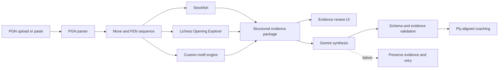

# Virtual Chess Coach

> An evidence-grounded AI workflow that turns a chess PGN into position-specific coaching using Stockfish, Lichess Opening Explorer, custom chess motifs, and Gemini.

[](https://github.com/PursuitGP/virtual-chess-coach/actions/workflows/ci.yml)

Virtual Chess Coach began as a senior-year computer science capstone and is now an actively maintained personal portfolio project. The application reviews the opening phase of an uploaded game, assembles structured evidence for every analyzed position, and asks an LLM to synthesize that evidence into understandable coaching.

The project is deliberately not built around an unaided chatbot. General-purpose language models are unreliable chess calculators. Stockfish supplies calculation, Lichess supplies empirical context, and a custom motif engine supplies domain-specific concepts. Gemini's role is to translate those inputs into useful instruction.


```text
PGN
 └─> legal moves and FEN positions
      ├─> Stockfish evaluation, change, best move, principal variation
      ├─> Lichess master and general-player opening statistics
      └─> custom tactical and positional motif detection
             └─> structured evidence package
                    └─> Gemini coaching for White, Black, or both
```

## What it demonstrates

- Full-stack orchestration across a React client, Flask API, local chess engine, external statistical API, and generative AI provider
- Evidence-grounded LLM prompting with strict, ply-aligned structured-output validation
- Domain modeling that combines deterministic calculation, population statistics, and heuristic chess knowledge
- Explicit failure boundaries: AI errors never become invented or generic substitute coaching
- Deployment-aware resource limits, caching, rate limiting, health checks, tests, and Docker packaging

## Current capabilities

### PGN intake and review

- Upload a `.pgn` file or paste PGN text
- Normalize common PGN formatting problems
- Display game metadata and replay every legal move on a Chessground board
- Navigate with buttons or arrow, Home, and End keys
- Inspect the current FEN and evaluation history

### Structured chess evidence

For each analyzed ply, the backend records:

- The played move, acting side, previous FEN, and resulting FEN
- Stockfish evaluation, change from the preceding position, best move, and top line
- Lichess master and aggregate-player frequency and outcome statistics
- Likely continuations and opening metadata when available
- Custom positional and tactical motifs

Theory classification is calculated against the position before the move was played. Duplicate Lichess position queries are cached, and one bounded Stockfish instance evaluates the game sequentially.

### AI coaching

- Coaching runs only after the user explicitly requests it
- Perspective can be White, Black, or both
- Gemini must return one validated object for every analyzed ply
- Every explanation identifies the Stockfish, Lichess, or motif evidence it used
- Misaligned moves, missing plies, malformed JSON, and invented evidence references are rejected
- Failed AI requests preserve the completed analysis and expose a retry action

There is intentionally no deterministic prose fallback. Raw engine output and statistics remain inspectable, but they are not mislabeled as completed coaching.

## Architecture



The production container serves the React build and Flask API from one origin:

```text
Browser ──> Gunicorn / Flask ──> Stockfish process
                         ├─────> explorer.lichess.ovh
                         └─────> Gemini API
```

## Technology

| Layer | Technology |
| --- | --- |
| Interface | React 19, Chessground, chess.js, Chart.js |
| API | Python 3.12+, Flask, Gunicorn |
| Engine | Stockfish |
| Chess data | Lichess Opening Explorer |
| Domain logic | python-chess and a custom motif engine |
| AI synthesis | Google GenAI SDK with Gemini |
| Deployment | Docker and Railway configuration |
| Verification | Python `unittest`, Jest, production build, GitHub Actions |

## Run locally

### Prerequisites

- Node.js 22+
- Python 3.12+
- Stockfish installed locally

On macOS:

```bash
brew install stockfish
```

On Linux, install the `stockfish` package through the system package manager. On Windows, install an official Stockfish binary and set `STOCKFISH_PATH` to the executable.

### Backend

```bash
python3 -m venv .venv
source .venv/bin/activate
pip install -r backend/requirements.txt
cp backend/.env.example backend/.env
python backend/app.py
```

The evidence pipeline works without Gemini, but completed coaching requires:

```dotenv
GEMINI_API_KEY=your_api_key
```

Never commit `backend/.env`. If a key has ever been exposed outside your local machine, rotate it before deployment.

### Frontend

In a second terminal:

```bash
npm ci
npm start
```

Create React App proxies `/api` requests to `http://127.0.0.1:5000`. Set `REACT_APP_API_BASE_URL` only when the frontend and backend intentionally use different origins.

### Docker

```bash
docker build -t virtual-chess-coach .
docker run --rm -p 8080:8080 \
  -e GEMINI_API_KEY="$GEMINI_API_KEY" \
  virtual-chess-coach
```

Open `http://localhost:8080`.

## API

### `GET /api/health`

Reports Stockfish and Gemini availability plus public analysis limits. It does not contact Gemini.

### `POST /api/analyze`

Accepts multipart form data with a `file` field. It returns metadata, provider status, warnings, truncation information, and the complete per-ply evidence package. It never invokes Gemini.

### `POST /api/explain`

Accepts:

```json
{
  "analysis": {
    "analysis_id": "...",
    "positions": []
  },
  "perspective": "white"
}
```

`perspective` must be `white`, `black`, or `both`. Successful output is validated against the submitted analysis before it reaches the UI.

## Safety and resource controls

Public defaults are intentionally conservative:

- Maximum upload: 256 KB
- Maximum analysis: 20 plies
- Public Stockfish depth in Docker: 14
- One Gunicorn worker with two request threads
- Analysis limit: 20 requests per IP per hour
- Gemini limit: 5 requests per IP per hour
- In-memory cache for identical coaching requests
- Same-origin production requests and no unrestricted CORS
- Development-only motif endpoint
- No logging of raw PGNs, complete prompts, or API keys

These controls are appropriate for a single-instance portfolio demonstration, not a high-scale commercial service.

## Test and benchmark

```bash
python -m unittest discover -s backend/tests -v
npm test -- --watchAll=false
npm run build
```

Benchmark the bundled PGNs without external network latency:

```bash
python scripts/benchmark_analysis.py --offline
```

Remove `--offline` to include live Lichess requests.

The tests cover PGN parsing, Unicode and headerless games, upload limits, Stockfish normalization, Lichess failure behavior, theory alignment, motif smoke checks, AI schema validation, unsupported evidence rejection, caching, retryable provider failures, rate limits, frontend evaluation helpers, and production compilation.

## Deployment

The repository includes a multi-stage `Dockerfile` and `railway.toml`.

1. Create a Railway project from this repository.
2. Let Railway build the included Dockerfile.
3. Add `GEMINI_API_KEY` as a secret.
4. Keep `APP_ENV=production`, `TRUST_PROXY=true`, and `STOCKFISH_DEPTH=14`.
5. Confirm `/api/health` before sharing the URL.

The service is deployment-ready at the repository level, but this README does not claim a live public deployment until one has been created and monitored.

## Known limitations

- Analysis is intentionally opening-focused and defaults to the first 20 plies.
- Motifs are handcrafted heuristics. They encode meaningful chess knowledge but can produce false positives or miss concepts.
- Lichess statistics may be sparse or unavailable for unusual positions.
- Stockfish UCI moves are not yet converted to SAN in every evidence display.
- Gemini coaching can still be incorrect despite grounding and validation. It is educational assistance, not authoritative analysis.
- Rate limiting and coaching cache are process-local; horizontal scaling would require shared infrastructure.
- There are no user accounts or saved analysis histories.

## Roadmap

- Add fixture-based accuracy tests for individual motif detectors
- Convert Stockfish lines from UCI to SAN for clearer coaching evidence
- Add rating filters and player-specific Lichess exploration
- Add queued full-game analysis after the opening workflow is stable
- Add persistent shared caching if public usage justifies it
- Publish a monitored deployment, product screenshot, and short demo video

## Project history and authorship

The original capstone was created by:

- Daniel G. Pineda
- Tristan Berry
- Cristian Porras

Daniel now maintains the project and is the primary author of the current analysis orchestration, custom motif system, evidence-grounded AI workflow, and ongoing full-stack integration. Git history preserves the original collaborators' frontend and Stockfish integration work and also records welcome-page UI contributions from `tariqdesigns`.

This positioning is intentionally precise: the project began collaboratively, while its continued development and present portfolio direction are Daniel's personal work.

## License

[MIT](LICENSE) © 2025 Daniel G. Pineda
