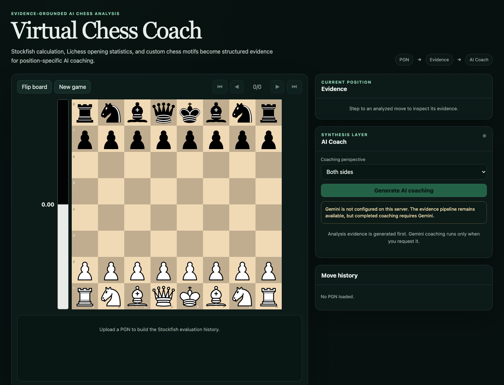
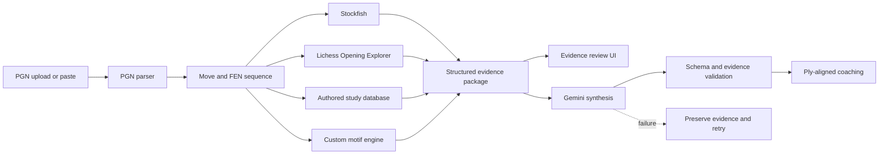

# Virtual Chess Coach

> An evidence-grounded AI workflow that turns a chess PGN into position-specific coaching using Stockfish, Lichess Opening Explorer, authored studies, custom chess motifs, and Gemini.

[](https://github.com/PursuitGP/virtual-chess-coach/actions/workflows/ci.yml)

Virtual Chess Coach began as a senior-year computer science capstone and is now an actively maintained personal portfolio project. The application reviews the opening phase of an uploaded game, assembles structured evidence for every analyzed position, and asks an LLM to synthesize that evidence into understandable coaching.

The project is deliberately not built around an unaided chatbot. General-purpose language models are unreliable chess calculators. Stockfish supplies calculation, Lichess supplies empirical context, authored studies supply optional human plans, and a custom motif engine supplies domain-specific concepts. Gemini's role is to translate those inputs into useful instruction.



```text
PGN
 └─> legal moves and FEN positions
      ├─> Stockfish evaluation, change, best move, and principal variation
      ├─> Lichess master and rating-filtered player statistics
      ├─> versioned project-authored study context
      └─> custom tactical and positional motif detection
             └─> structured evidence package
                    └─> Gemini coaching for White, Black, or both
```

## What it demonstrates

- Full-stack orchestration across a React client, Flask API, local chess engine, external statistical API, and generative AI provider
- Evidence-grounded LLM prompting with strict, ply-aligned structured-output validation
- Domain modeling that combines deterministic calculation, population statistics, and heuristic chess knowledge
- Explicit failure boundaries: AI errors never become invented or generic substitute coaching
- Deployment-aware resource limits, caching, rate limiting, health checks, tests, and Docker packaging

## Current capabilities

### PGN intake and review

- Upload a `.pgn` file or paste PGN text
- Recreate a game manually on a legal-move board and submit the generated PGN
- Normalize common PGN formatting problems
- Display game metadata and replay every legal move on a Chessground board
- Toggle review arrows for the played move and Stockfish's first choice while
  retaining Chessground's right-click drawing controls
- Navigate with buttons or arrow, Home, and End keys
- Inspect the current FEN and evaluation history

### Structured chess evidence

For each analyzed ply, the backend records:

- The played move, acting side, previous FEN, and resulting FEN
- Stockfish evaluation, mover-specific evaluation loss, best move, and principal variation
- Lichess master and rating-filtered aggregate-player frequency, win, draw, loss, and score statistics
- Up to five likely continuations from each database
- Engine-backed practical continuation candidates that join Stockfish lines to human frequency and results
- Conservative signals such as `master-aligned-and-sound`, `common-rating-pool-mistake`, and `sound-novelty-candidate`
- Curated opening names/ECO codes plus optional versioned study context matched by position, move, or opening family
- Confidence-gated positional and tactical motifs
- Deterministic move labels (`best`, `excellent`, `good`, `inaccuracy`,
  `mistake`, `blunder`) with the measured engine loss included in the evidence

Theory classification is calculated against the position before the move was played. “Novelty” is always labeled as a candidate: absence from the selected sample does not prove historical novelty. Lichess statistics are treated as descriptions of human behavior, never as objective evaluations.

Move labels use the public Lichess-style approach: Stockfish centipawn scores
are converted into modeled winning chances, then losses of `0.10`, `0.20`, and
`0.30` mark an inaccuracy, mistake, and blunder respectively. Newly allowing a
forced mate is always a blunder. Raw centipawn loss remains visible, but a
fixed two-pawn swing is not automatically treated the same in an equal position
and in a position that was already decisively won.

Duplicate Lichess position queries are cached. The master and aggregate-player databases use two bounded request streams while each database remains chronological, and both run concurrently with one bounded Stockfish process. A per-database circuit breaker stops an outage or exhausted sample from turning into dozens of repeated calls. Stockfish retains the game history needed for repetition-aware analysis.

The default opening window is 20 plies—ten White-and-Black move pairs—and therefore requires 21 primary engine searches including the initial position. Stockfish stops when it reaches either target depth 24 or the 1.25-second per-position ceiling. A 14-second primary-search budget automatically lowers the per-position ceiling for longer opening windows. Primary analysis uses MultiPV 1 for a strong best line. Up to four tactical or evaluation-critical decisions then receive a short MultiPV 4 comparison so the coach can distinguish a normal best move, a clearly superior move, and an engine-supported only move.

The production image builds a pinned Stockfish 18 binary from the official source tag. Runtime defaults use one engine thread and 64 MB of hash so the service remains bounded on a small portfolio deployment.

### Motif confidence boundary

The custom motif engine is intentionally treated as a developing domain system rather than an infallible classifier:

- High-confidence motifs have literal, directly testable board-state definitions, such as forced mate, absolute pins, double check, bishop pair, and pawn-structure facts.
- Medium-confidence motifs encode useful but more interpretive concepts, such as development leads, center counterstrikes, Fried Liver attraction, and diagonal pressure.
- Experimental detectors remain in the codebase but are withheld from Gemini until position fixtures demonstrate acceptable precision.
- The evidence package records how many experimental candidates were suppressed.

The Fried Liver line `1. e4 e5 2. Nf3 Nc6 3. Bc4 Nf6 4. Ng5 d5 5. exd5 Nxd5 6. Nxf7 Kxf7 7. Qf3+ Kg8` is covered as a regression fixture for diagonal pressure, the f7 weakness, the knight fork, king attraction, the absolute pin, and the resulting forced mate.

### AI coaching

- Uploading a game automatically runs evidence collection followed by AI coaching
- Perspective can be White, Black, or both
- Gemini must return one validated object for every analyzed ply
- Explanations target roughly 70–140 position-specific words, with a 180-word
  readability ceiling, and receive the
  previous position, the current evidence, and the opponent's next played move
- Every explanation identifies the Stockfish, Lichess, study, or motif evidence it used
- Misaligned moves, missing plies, malformed JSON, and invented evidence references are rejected
- Failed AI requests preserve the completed analysis and expose a retry action
- AI generation is paused unless Stockfish, Lichess, and motif evidence are all available
- The LLM is not allowed to browse the internet; opening context and recommendations must come from the submitted evidence

There is intentionally no deterministic prose fallback. Raw engine output and statistics remain inspectable, but they are not mislabeled as completed coaching.

The browser chains the two public API stages automatically and presents one
review loading screen. `/api/analyze` still remains independent from Gemini so
completed chess evidence can be preserved and retried if `/api/explain` fails.

## Architecture



The production container serves the React build and Flask API from one origin:

```text
Browser ──> Gunicorn / Flask ──> Stockfish process
                         ├─────> explorer.lichess.org
                         └─────> Gemini API
```

## Technology

| Layer | Technology |
| --- | --- |
| Interface | React 19, Chessground, chess.js, Chart.js |
| API | Python 3.12+, Flask, Gunicorn |
| Engine | Stockfish 18 in production |
| Chess data | Lichess Opening Explorer |
| Domain logic | python-chess, authored JSON studies, and a custom motif engine |
| AI synthesis | Google GenAI SDK with Gemini 3.1 Flash Lite by default |
| Deployment | Docker and Railway configuration |
| Verification | Python `unittest`, Jest, production build, GitHub Actions |

## Run locally

### Prerequisites

- Node.js 22+
- Python 3.12+
- Stockfish installed locally

On macOS:

```bash
brew install stockfish
```

On Linux, install the `stockfish` package through the system package manager. On Windows, install an official Stockfish binary and set `STOCKFISH_PATH` to the executable.

### Backend

```bash
python3 -m venv .venv
source .venv/bin/activate
pip install -r backend/requirements.txt
cp backend/.env.example backend/.env
python backend/app.py
```

Completed coaching requires both provider credentials:

```dotenv
GEMINI_API_KEY=your_api_key
LICHESS_TOKEN=your_personal_access_token
```

Create the Lichess token at <https://lichess.org/account/oauth/token>. The Opening Explorer endpoint currently documents OAuth without a special scope.

Never commit `backend/.env`. If a credential has ever been exposed outside your local machine, rotate it before deployment.

### Frontend

In a second terminal:

```bash
npm ci
npm start
```

Create React App proxies `/api` requests to `http://127.0.0.1:5050`. Port 5050 avoids the common macOS AirPlay Receiver/Control Center collision on port 5000. Set `REACT_APP_API_BASE_URL` only when the frontend and backend intentionally use different origins.

### Temporary friend testing

For friends on the same Wi-Fi, build the frontend and serve the complete app
from Gunicorn:

```bash
npm run build
.venv/bin/gunicorn --bind 0.0.0.0:5050 --workers 1 --threads 2 \
  --timeout 180 backend.app:app
```

Share `http://YOUR_MAC_LAN_IP:5050` while the process is running. For friends
outside the local network, prefer Railway. A short-lived Cloudflare or ngrok
tunnel can be used for a supervised test, but the random URL should not be
posted publicly because visitors consume the owner's Gemini quota.

The application currently allows 20 analyses and 5 Gemini coaching requests per
detected IP per hour. Gemini's own limits are project-wide and must be checked
in Google AI Studio. One Gunicorn worker with two threads is appropriate for a
few testers, not a public load test.

### Docker

```bash
docker build -t virtual-chess-coach .
docker run --rm -p 8080:8080 \
  -e GEMINI_API_KEY="$GEMINI_API_KEY" \
  -e LICHESS_TOKEN="$LICHESS_TOKEN" \
  virtual-chess-coach
```

Open `http://localhost:8080`.

## Authored study database

`backend/data/studies.json` is the low-latency home for human opening and
position knowledge. It is validated at startup and can match an entry by:

- Position before or after a move, stored as normalized EPD
- The played move in UCI notation
- An exact Lichess opening name
- An opening-family prefix

Position-and-move entries outrank broad opening-family entries. Study notes are
optional context: they never override Stockfish, the submitted board, or motif
evidence. Validate edits with:

```bash
python scripts/validate_studies.py
```

The JSON format is deliberately import-friendly. A later sync command can
convert comments and variations from a project-owned Lichess Study into these
entries without adding runtime scraping or network latency to game review.

## API

### `GET /api/health`

Reports Stockfish and Gemini availability plus public analysis limits. It does
not contact Gemini. Railway uses this endpoint to confirm that the web service
started and can answer requests.

### `GET /api/ready`

Returns HTTP 200 only when Stockfish, Gemini configuration, Lichess
configuration, and the local study database are ready. Check this stricter
endpoint before sharing a deployment.

### `POST /api/analyze`

Accepts multipart form data with:

- `file`: required PGN
- `rating_group`: optional Lichess rating bucket (`0`, `1000`, `1200`, …, `2500`)
- `speeds`: optional comma-separated Lichess speed filters

It returns metadata, filters, provider status, warnings, truncation information, the initial Stockfish analysis, and the complete per-ply evidence package. It never invokes Gemini.

### `POST /api/explain`

Accepts:

```json
{
  "analysis": {
    "analysis_id": "...",
    "positions": []
  },
  "perspective": "white"
}
```

`perspective` must be `white`, `black`, or `both`. Successful output is validated against the submitted analysis before it reaches the UI. Requests with incomplete Stockfish, Lichess, or motif evidence are rejected instead of asking the model to improvise around missing inputs.

## Safety and resource controls

Public defaults are intentionally conservative:

- Maximum upload: 256 KB
- Maximum analysis: 20 plies (ten complete White-and-Black move pairs)
- Stockfish 18 target depth: 24
- Per-position engine ceiling: 1.25 seconds
- Total primary Stockfish budget per review: 14 seconds
- Primary Stockfish MultiPV: 1
- Selective critical-position comparison: MultiPV 4, at most four positions,
  with a 0.3-second ceiling per comparison
- Stockfish resources: 1 thread and 64 MB hash
- One Gunicorn worker with two request threads
- Analysis limit: 20 requests per IP per hour
- Gemini limit: 5 requests per IP per hour
- One bounded retry for transient Gemini overload and 5xx failures
- In-memory cache for identical coaching requests
- Same-origin production requests and no unrestricted CORS
- Development-only motif endpoint
- No logging of raw PGNs, complete prompts, or API keys

These controls are appropriate for a single-instance portfolio demonstration, not a high-scale commercial service.

## Test and benchmark

```bash
python -m unittest discover -s backend/tests -v
python scripts/validate_studies.py
npm test -- --watchAll=false
npm run build
```

Benchmark the bundled PGNs without external network latency:

```bash
python scripts/benchmark_analysis.py --offline
```

Remove `--offline` to include live Lichess requests.

Benchmark only the configured Stockfish contract:

```bash
python scripts/benchmark_stockfish.py
```

The Stockfish benchmark reports the exact engine build, achieved
minimum/median/maximum depth, search time, and total wall time. Re-run it on the
deployment machine because depth reached within a time limit depends on
available CPU.

Representative measurements on the maintainer's Apple Silicon development
machine with Stockfish 18:

| Stage | Wall time | Notes |
| --- | ---: | --- |
| Exact 19-ply mating-line evidence request | 11.4 s | Cold process; median engine depth 20.5 |
| Validated 19-ply Gemini 3.1 Flash-Lite coaching | 24.8 s | 19 detailed structured explanations |
| Complete 19-ply opening review | 36.2 s | Evidence plus coaching |

The UI targets roughly 30–45 seconds for the complete opening review. These are
measurements, not cross-machine or provider guarantees: Lichess throttling,
Gemini load, and deployment CPU can increase latency. The loading screen shows
the active stage and elapsed time rather than pretending the request has
stalled.

Verify configured external credentials with minimal requests:

```bash
python scripts/check_providers.py
```

The tests cover PGN parsing, Unicode and headerless games, upload limits, Stockfish search metadata, selective MultiPV move classification, study-database validation and matching, rating-filtered Lichess request shapes and outcomes, provider failure behavior, theory alignment, confidence-gated motifs, the Fried Liver regression line, AI schema validation, unsupported evidence rejection, caching, incomplete-evidence rejection, rate limits, frontend evaluation helpers, and production compilation.

## Deployment

The repository includes a multi-stage `Dockerfile` and `railway.toml`.

1. Create a Railway project from this repository.
2. Let Railway build the included Dockerfile.
3. Add `GEMINI_API_KEY` and `LICHESS_TOKEN` as secrets.
4. Keep the bounded Stockfish defaults unless Railway benchmarks justify changing them.
5. Confirm `/api/ready` before sharing the URL.
6. Run one deployed end-to-end review:

```bash
python scripts/check_deployment.py https://YOUR-DOMAIN \
  --pgn pgns/scholars_mate.pgn
```

The service is deployment-ready at the repository level, but this README does not claim a live public deployment until one has been created and monitored.

## Known limitations

- Analysis is intentionally opening-focused and defaults to the first 20 plies.
- Published motifs are confidence-gated handcrafted heuristics. They can still miss concepts, while experimental detectors remain withheld pending fixture-based validation.
- Lichess statistics may be sparse or unavailable for unusual positions.
- The authored study database starts small and must be expanded or imported from project-owned Lichess Studies over time.
- Stockfish lines are converted to SAN for display, while UCI remains in the evidence package for exact machine alignment.
- Gemini coaching can still be incorrect despite grounding and validation. It is educational assistance, not authoritative analysis.
- Rate limiting and coaching cache are process-local; horizontal scaling would require shared infrastructure.
- There are no user accounts or saved analysis histories.

## Roadmap

- Expand motif fixtures beyond the Fried Liver and promote experimental detectors only after precision checks
- Add optional individual-player Lichess exploration in addition to the current aggregate rating filters
- Add queued full-game analysis after the opening workflow is stable
- Add persistent shared caching if public usage justifies it
- Publish a monitored deployment, product screenshot, and short demo video

## Project history and authorship

The original capstone was created by:

- Daniel G. Pineda
- Tristan Berry
- Cristian Porras

Daniel now maintains the project and is the primary author of the current analysis orchestration, custom motif system, evidence-grounded AI workflow, and ongoing full-stack integration. Git history preserves the original collaborators' frontend and Stockfish integration work and also records welcome-page UI contributions from `tariqdesigns`.

This positioning is intentionally precise: the project began collaboratively, while its continued development and present portfolio direction are Daniel's personal work.

## License

[MIT](LICENSE) © 2025 Daniel G. Pineda
